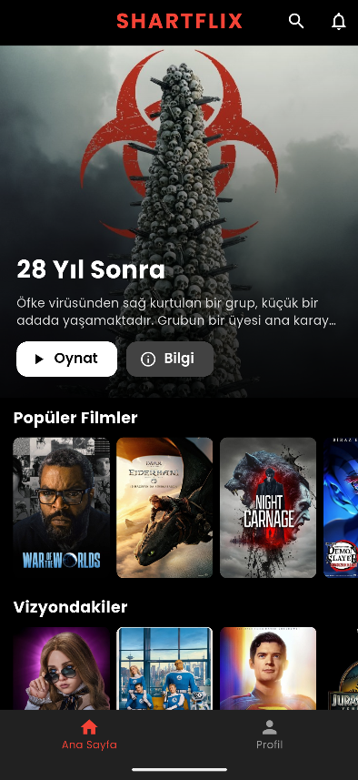
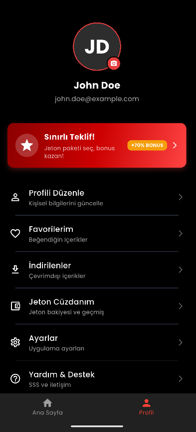
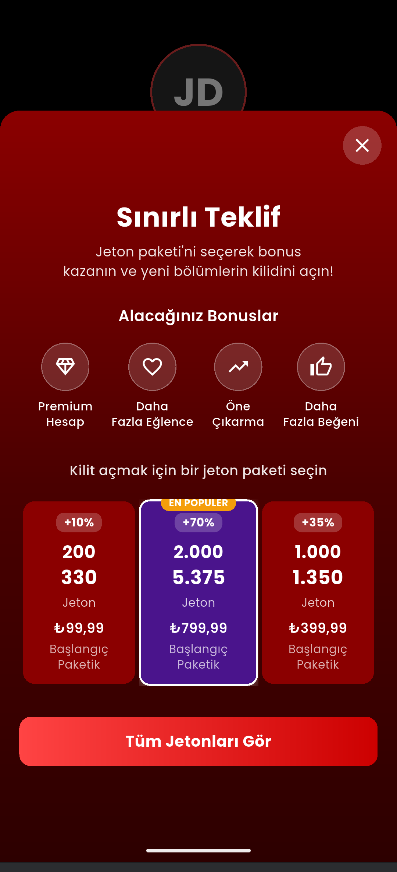
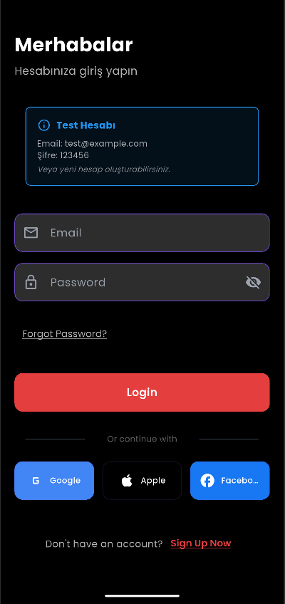

# shartflix
🇺🇸 English:
Shartflix is a Netflix-inspired mobile replica app developed by Atakh4n for NodeLabs Software using Flutter. It allows users to explore movies and series with a beautiful and modern UI. The app is open and free for everyone to use.

🇹🇷 Türkçe:
Shartflix, Atakh4n tarafından NodeLabs Software için geliştirilen, Flutter tabanlı bir Netflix replikası mobil uygulamadır. Kullanıcıların film ve dizi içeriklerini modern ve şık bir arayüz ile keşfetmesini sağlar. Uygulama herkese açık ve ücretsizdir.

🙏 Credit / Katkıya Saygı 
🇺🇸 English:
If you use this project in your own applications, demos, or repositories, please consider giving proper credit.
Mentioning Atakh4n and NodeLabs Software, and linking back to this repository or including a note in your README, is highly appreciated.

Example:
"Built using Shartflix — developed by Atakh4n for NodeLabs Software."

🇹🇷 Türkçe:
Bu projeyi kendi uygulamanızda, sunumlarınızda veya açık kaynak çalışmalarınızda kullanıyorsanız, lütfen uygun şekilde kredi verin.
Atakh4n ve NodeLabs Software isminin geçmesi ve bu GitHub deposuna bağlantı verilmesi ya da README dosyanızda kısa bir not düşülmesi memnuniyetle karşılanır.

Örnek:
"Bu proje Shartflix temel alınarak geliştirilmiştir — Atakh4n tarafından NodeLabs Software için yapılmıştır."


## 🚀 Kurulum | Getting Started

### 🇹🇷 Gereksinimler  
- Flutter 3.x.x  
- Dart 3.x.x  
- Android Studio veya VS Code

### 🇺🇸 Requirements  
- Flutter 3.x.x  
- Dart 3.x.x  
- Android Studio or VS Code

---

### ⚠️ Önemli | Important

**🇹🇷 Bu proje gerçek bir API ile çalışmaktadır.**  
Uygulamanın düzgün çalışabilmesi için kök dizine `.env` adında bir dosya oluşturmalı ve içerisine [TMDB](https://www.themoviedb.org/) API anahtarınızı şu formatta yapıştırmalısınız:
Aksi takdirde uygulama API bağlantı hatası verir ve içerik yüklenemez.

**🇺🇸 This project works with a real API.**  
To run the app properly, create a `.env` file in the root directory and paste your [TMDB](https://www.themoviedb.org/) API key in the following format:
Otherwise, the app will fail to fetch content and produce API-related errors.

### ⚠️ Örnek Kullanım | Example 

```
TMDB_API_KEY=YOUR_TOKEN_HERE 
TMDB_BASE_URL=https://api.themoviedb.org/3
TMDB_IMAGE_BASE_URL=https://image.tmdb.org/t/p/w500
```

## 📸 Ekran Görüntüleri / Screenshots
### Ana Sayfa / Home Page



### Profil Sayfası / Profile Page



### Profil Sayfası - 2 / Profile Page - 2



### Giriş Sayfası / Login Page



### 🔧 Kurulum Adımları | Installation
```bash
git clone https://github.com/kullaniciadi/shartflix.git
cd shartflix
flutter pub get
flutter run

---


